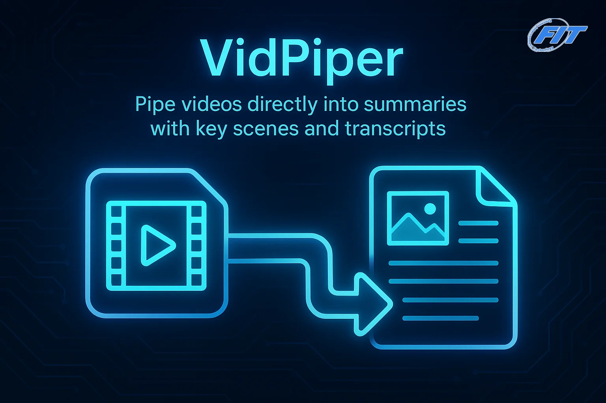
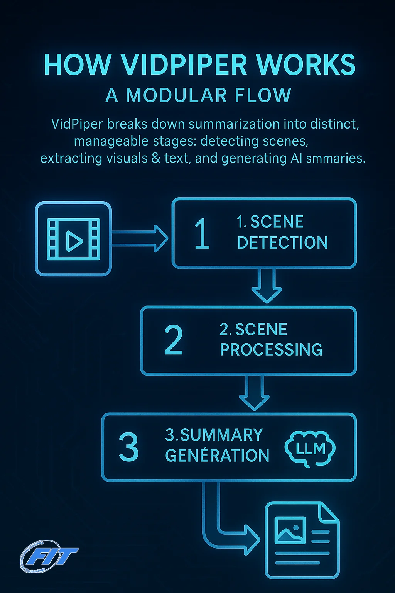

<p align="center"></p>

# FIT VidPiper

A modular pipeline for generating text summaries of video webinar content with screenshots and transcripts.

## Features

- **Modular Pipeline Architecture**: Split the video summarization workflow into independent stages that can be run separately or as a complete pipeline.
- **Scene Detection**: Automatically detect scene changes in videos using PySceneDetect.
- **Scene Processing**: Extract screenshots and transcripts for each scene.
- **Summary Generation**: Use LLMs (Anthropic Claude, OpenAI GPT-4, Google Gemini) to generate summaries of each scene.
- **Extensible Design**: Create custom pipeline stages and insert them at any point in the pipeline.
- **Checkpoint System**: Save and load the state of the pipeline at any point to enable pausing and resuming processing.

<p align="center"></p>

## Requirements

- Python 3.8+
- Poetry (for dependency management)
- FFmpeg installed on the system
- GPU recommended for faster processing (especially for Whisper transcription)

Install the required packages using Poetry:

```bash
poetry install
```

## Environment Setup

Before running the scripts, ensure that your API keys are set as environment variables. You can do this by creating a `.env` file (or any other file) and sourcing it in your shell. Your shell should automatically source this file whenever a new terminal is started.

Example:

```bash
# In your .env file (or equivalent):
export ANTHROPIC_API_KEY=your_anthropic_api_key
export OPENAI_API_KEY=your_openai_api_key
export GEMINI_API_KEY=your_gemini_api_key
```

Then, in your shell's configuration file (e.g., `.bashrc`, `.zshrc`), add a line like:

```bash
source /path/to/your/.env
```

(Replace `/path/to/your/.env` with the actual path to your `.env` file.)

This will ensure that the API keys are available as environment variables whenever you run the scripts.

## Usage

### Complete Pipeline

Run the complete pipeline with the CLI tool:

```bash
# Basic usage
python vidpiper_cli.py /path/to/video.mp4

# With options
python vidpiper_cli.py /path/to/video.mp4 \
  --output-dir my_output \
  --threshold 30.0 \
  --skip-start 60.0 \
  --use-whisper \
  --llm-provider anthropic
```

### Individual Stages

The individual stages can be run using the standalone scripts located in the `standalone_stages` directory, or by using the `vidpiper_cli.py` script with the `--run-mode` option.

Using the standalone scripts provides a simpler interface for running individual stages, while using the `vidpiper_cli.py` script allows for running the entire pipeline or individual stages with more advanced options.

1. Scene Detection:

```bash
# Detect scenes and save to JSON
python standalone_stages/detect_scenes.py /path/to/video.mp4 \
  --threshold 35.0 \
  --skip-start 60.0
```

or

```bash
# Detect scenes using vidpiper_cli.py
python vidpiper_cli.py /path/to/video.mp4 --run-mode detect --threshold 35.0 --skip-start 60.0
```

2. Scene Processing:

```bash
# Process scenes (extract screenshots and transcripts)
python standalone_stages/process_scenes.py \
  --input-file video_output/detected_scenes.json \
  --use-whisper
```

or

```bash
# Process scenes using vidpiper_cli.py
python vidpiper_cli.py --run-mode process --input-file video_output/detected_scenes.json --use-whisper
```

3. Summary Generation:

```bash
# Generate summary
python standalone_stages/generate_summary.py \
  --input-file video_output/processed_scenes.json \
  --llm-provider gemini
```

or

```bash
# Generate summary using vidpiper_cli.py
python vidpiper_cli.py --run-mode summarize --input-file video_output/processed_scenes.json --llm-provider gemini
```

### Custom Pipelines

Create custom pipelines by extending the base classes:

```python
from vidpiper.core import Pipeline, PipelineStage, PipelineResult
from vidpiper.stages import create_scene_detector, create_scene_processor

# Create a custom stage
class MyCustomStage(PipelineStage):
    def run(self, data: PipelineResult) -> PipelineResult:
        # Custom processing logic here
        return data

# Create a pipeline with custom stages
pipeline = Pipeline()
pipeline.add_stage(create_scene_detector())
pipeline.add_stage(MyCustomStage())
pipeline.add_stage(create_scene_processor(output_dir="output"))

# Run the pipeline
result = pipeline.run(PipelineResult(video_path="/path/to/video.mp4"))
```

See `custom_pipeline_example.py` for a complete example of a custom pipeline.

## Module Structure

```
vidpiper/
  ├── core/                       # Core pipeline components
  │   ├── data_classes.py         # Data classes for pipeline stages
  │   └── pipeline.py             # Pipeline infrastructure
  ├── stages/                     # Pipeline stage implementations
  │   ├── scene_detector.py       # Scene detection stage
  │   ├── scene_processor.py      # Screenshot and transcript extraction
  │   └── summary_generator.py     # Summary generation with LLMs
  └── llm_providers/              # LLM API provider implementations
      ├── base.py                 # Base LLM provider interface
      ├── anthropic_provider.py     # Claude implementation
      ├── openai_provider.py        # GPT-4 implementation
      └── gemini_provider.py        # Gemini implementation
standalone_stages/                  # Standalone stage implementations
  ├── detect_scenes.py
  ├── process_scenes.py
  ├── summary_generator.py
  └── format_summaries.py
```

## Customization Options

### Scene Detection

- **Threshold**: Sensitivity of scene detection (lower = more scenes)
- **Downscale**: Reduce resolution for faster processing
- **Skip Start/End**: Ignore portions at the beginning/end of the video
- **Max Size**: Maximum size in MB for each scene
- **Max Scene**: Maximum number of scenes to detect

### Scene Processing

- **Use Whisper**: Enable/disable transcript generation with Whisper
- **Whisper Model**: Choose model size (tiny, base, small, medium, large)

### Summary Generation

- **LLM Provider**: Choose which AI model to use (anthropic, openai, gemini)
- **Model**: Specific model name
- **Max Tokens**: Maximum tokens per API request

## Sample Output

The output includes:
- JSON files with scene metadata
- Screenshots for each scene
- A Markdown summary with screenshots and scene descriptions
- (Optional) Checkpoint files for resuming processing

## License

MIT
